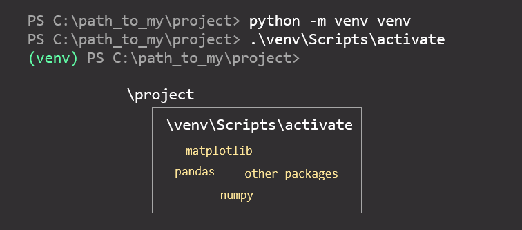
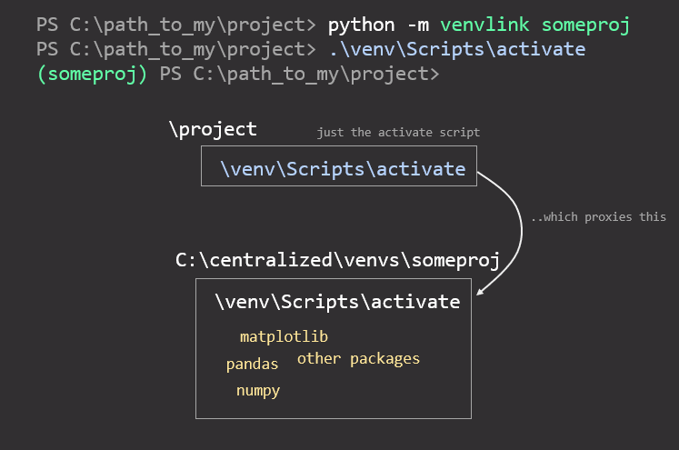

&nbsp;&nbsp;&nbsp;

# 🔗 venvlink


The aim of `venvlink` is simply to create the virtual environment outside of the project folder, but *feel like* `python -m venv venv`. 

## Without venvlink
This is how work with virtual environments looks like with `python -m venv venv`:


## With venvlink
With `venvlink` the virtual environment is created in a centralized folder, and only a proxy ("link") of the `activate` script is created to the project folder:



## Motivation
The reason for one using venvlink might be one or multiple from below.
### 🚫📤 don't backup venv/*
If you want to keep your virtual environments from being backed up to *e.g.* OneDrive/Dropbox or other backup service with your project files, venvlink is one way to do it. You might want to do this to save space on your cloud storage or resources on your computer / network (prevent checking and uploading new/modified files).

### 🗂️🧹centralized & tidy
If you want to centralize your virtual environments just because you think it is clean or it makes you happy.

### ✨♻️ reusability
If you want to reuse some of your virtual environments in multiple projects (sharing same imports) or want to use a general `(tmp)` virtual environment for all of your one-off testing, for example.

### 🏗️✔️relocating projects
If you want to be able to relocate projects on hard disk (on same machine) by just copy-pasting them, even with virtual environments. 

### 🔑🎯 activating like you've always done

If you want to have centralized virtual environments, but would still want to activate them as you have always done: with

```
./venv/Scripts/activate
```
The `activate` script in your project folder is just a proxy ("link") for the real `activate` script located elsewhere. There is *no need to remember the name* of the virtual environment as with some other virtual environment management tools.


### 🗑️🤝 remove anytime
The `venvlink` philosophy is that a tool should not chain it's user. You can remove it anytime and *your virtual environments and activate proxy scripts will still work*.


### 💼✔️ works with an existing venv collection
If you happen to have already a collection of virtual environments inside one folder, you can start using them with `venvlink` right away. 


### 🐍🐍 multipython
It is not a problem if you have multiple python versions installed. The syntax is

```
<path_to_python_exe> -m venvlink ...
```

Therefore, you can use `venvlink` on `Python 3.6.4 32-bit` and `Python 3.9.2 64-bit` at the same time. What you need to do is to install `venvlink` for both python versions with 

```
<path_to_python_exe> -m pip install venvlink
<path_to_another_python_exe> -m pip install venvlink
```

and the rest you can use normally. Note that virtual environments in the centralized folder will have the same python version which was used to create the virtual environment in the first place. **Note**: Knowing which python version is used in which virtual environment in rensibilities of the user (use wise venv names, if needed).


# Installing
### Requirements
`venvlink` is currently supporting only Windows, but it shouldn't be too hard to create Linux/maxOS support. I personally use only Windows, but I would be really happy to receive pull request(s) for Linux/macOS support.
## Installation with pip
```
pip install venvlink
```
<sup>For installation for development, see [CONTRIBUTING.md](docs/CONTRIBUTING.md).</sup>


# Usage

## 📖❔ Getting help
You can use  the `-h` flag:
```
python -m venvlink -h
```

## 🛠️ Initializing configure file

To create the initial `.venvlinkrc` file, use command

```
python -m venvlink --init
```


## ✨ Creating virtual environment

Assume that you have a project at 

```
C:\workdir\someproject\
```
and that you are in command line inside that folder (call it, `<project_root>`). Then, you would like to create virtual environment for that folder.

Instead of the regular
```python
# at C:\workdir\someproject\
python -m venv venv
```

One would type

```python
# at C:\workdir\someproject\
python -m venvlink project-name
```

This would create the following folders:

```
C:\workdir\someproject\venv
   ^-- This has only few files, such as the "activate" script.

C:\<venvlink-venv-path>\project-name
   ^--- The actual virtual environment files are here!
```

The first folder is for using the virtual environment normally, just like you have used to (running `venv/Scripts/activate`) and the second folder is for storing the actual virtual environment files.

### 🗑️ Removing virtual environments
If you want to fully remove a virtual environment and all its contents, you can either run
```
python -m venvlink -d <venv_to_be_removed>
```
 or just navigate to the centralized virtual env folder, and remove the folder(s) you want. There is no centralized bookkeeping between the virtual environments and the `activate` proxies (just a one-way link from proxy to the venv), and therefore all `activate` proxies associated with the venv will stop working after deletion, or until a venv with same name is created.

If you want to just remove the link between a virtual environment and your project, you can safely remove the `activate` proxy/link from your project folder. If you are planning to create a link to another virtual environment, you can simply

```
python -m venvlink anothervenv
```

All what this does is recreates the proxy and, if anothervenv does not exist, creates anothervenv.
  
## ⌨️ CLI

You can find the command line help with `python -m venvlink -h`:
```
usage: venvlink [-h] [--init] [-d] [-S] [projectname]

venvlink

positional arguments:
  projectname

optional arguments:
  -h, --help            show this help message and exit
  --init                Initiate the venvlink configuration file (.venvlinkrc)
  -d, --delete          Delete the virtual environment associated with project_name (instead of creating)
  -S, --system-site-packages
                        Give the virtual environment access to the system site-packages dir.
```

## 🛠️ Configuration
### Location of `.venvlinkrc`
The configuration file, `.venvlinkrc` should be located at 
```
%USERPROFILE%\.venvlinkrc
```
which usually translates into  `C:\Users\USER\.venvlinkrc`. 

### Contents of `.venvlinkrc`
Here is an example default config (copy-paste):

```
[general]
venv_folder = C:\Users\USER\venvs
```
**[general]: venv_folder** <br>
This is the folder where all the virtual environment are stored, in subfolders. 

## Considerations

### 🔍❕ Special cases

Moving your virtual environment to centralized place means that you'll might have to tell for example to `pylint` where to venv is located, to prevent false positive `import-error`s. See: [Usage with linters (e.g. pylint)](docs/usage.md).

### 💡📁 File structure tip
Following file structure has found to be useful:
```
C:\Python\Python365\
C:\Python\Python386\
C:\Python\Python386-32\
C:\Python\Python392\
C:\Python\venvs\ 
```
since it is easy to find `python.exe` behind for creating a venv

```
C:\Python\Python386\python.exe -m venvlink myproj
```
and it is also easy to browse the venvs when they are after a short path.

## Contributing


| What?                                | How?                                                                                     |
| :----------------------------------- | :--------------------------------------------------------------------------------------- |
| 🐞 Found a bug?                       | 🎟 <a href="https://github.com/np-8/venvlink/issues">File an Issue</a>                    |
| 🙋‍♂️ Need help?                         | ❔  <a href="https://stackoverflow.com/questions/ask">Ask a question on StackOverflow</a> |
| 💡  Want to submit a feature request? | <a href="https://github.com/np-8/venvlink/issues">🎫 File an Issue (feature request)</a>  |
| 🧙  Want to write code?               | 🔥 <a href="./docs/CONTRIBUTING.md">Here's how you get started!</a>                       |