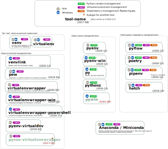

# Python environment management tools
Here is a list of different tools and how they relate to `venvlink`.


**Usage**: Click the image below to see the svg file (zoomable, with links)


[](https://raw.githubusercontent.com/np-8/venvlink/master/docs/tools-plain.svg)

## Anaconda / Miniconda 
- The [Anaconda](https://www.anaconda.com/) is a python distribution that is focused on scientific computing / Data Science, and comes with preinstalled packages. 
- It replaces `pip`, and `venv` with `conda` commands. 
- Comes with new concept called `conda environments`.
  
## [pew](https://github.com/berdario/pew) (Python Environment Wrapper)
- Virtual environment management tool, written in python
- **See also**: [venvlink and pew](venvlink-and-pew.md)
- Was originally a rewrite of virtualenvwrapper and has basically same functionality with cleaner API and multiplatform, multi-shell support.
- Leverages [inve](https://datagrok.org/python/activate/) ("inside this virtual environment, (run this command)…")
- Keeps all virtual environments in single location, which by default is either defined by environment variable `XDG_DATA_HOME` or `WORKON_HOME`.
- Works also on Windows (cmd.exe *and* Powershell)
- Integrates with `pythonz` (Unix only)

  
## [pipenv](https://github.com/pypa/pipenv)
- Python project management tool (replacement for `pip` and `venv`)
- **See also:** [venvlink and pipenv](venvlink-and-pipenv.md)

## [poetry](https://github.com/python-poetry/poetry)
- Python project management tool (replacement for `pip`, `venv`, `twine`, `setup.py`, ...)

## [py](https://docs.python.org/3.5/using/windows.html#python-launcher-for-windows)
- The [Python Launcher for Windows](https://docs.python.org/3.5/using/windows.html#python-launcher-for-windows) has been part of CPython since version 3.3
- The python launcher can be used as a simple python version management tool in Windows. 
    
## [pyenv](https://github.com/pyenv/pyenv)
- Python version management tool for Unix
- Does not manage virtual environments. One can use `pyenv-virtualenv` (Unix) to do that.
  
## [pyenv-win](https://github.com/pyenv-win/pyenv-win)
- Python version management tool for Windows.
- Windows fork of `pyenv`.
- **See also**: [venvlink and pyenv-win](venvlink-and-pyenv-win.md)
## [pyenv-virtualenv](https://github.com/pyenv/pyenv-virtualenv)
- Virtual environment management. Supports also conda environments.
- Plugin for `pyenv` (Unix only)
- Automatic activation: [Uses `.python-version` files](https://github.com/pyenv/pyenv-virtualenv#activate-virtualenv)

## [pyflow](https://github.com/David-OConnor/pyflow)
- Python project management tool (replacement for `pip`, `venv`, `twine`, `setup.py`, ...)
- Source: [https://github.com/David-OConnor/pyflow](https://github.com/David-OConnor/pyflow)
- Uses project-level `pyproject.toml`. 
  
## [pythonz](https://github.com/saghul/pythonz)
- Python version management / python installer for Unix
- Originally a fork of `pythonbrew`

## pyvenv
This was a short-lived tool (introduced in Python 3.3, [deprecated in 3.6](https://docs.python.org/dev/whatsnew/3.6.html#deprecated-features)) for creating virtual environments and was superceded by `python -m venv`. 


## venv
The [venv](https://docs.python.org/3/library/venv.html) is a module which is included in the CPython standard library since Python 3.3. It is commonly used with command

```
python -m venv venv
```

and this is the command `venvlink` uses internally to create virtual environments. 

## [virtualenvwrapper](https://bitbucket.org/virtualenvwrapper/virtualenvwrapper/src/master/)
- Source: [https://bitbucket.org/virtualenvwrapper/virtualenvwrapper/](https://bitbucket.org/virtualenvwrapper/virtualenvwrapper/src/master/)
- Docs: [virtualenvwrapper.readthedocs.io](https://virtualenvwrapper.readthedocs.io/)
- Places virtual environments in `$WORKON_HOME`
- Supported shells: `bash`, `ksh`, `zsh`. (Unix only)


## [virtualenvwrapper-powershell](https://github.com/regisf/virtualenvwrapper-powershell)
- Virtual environment management tool for Windows
- Works ***only*** with Powershell (not with `cmd.exe`)
- Creates virtual environments into: `WORKON_HOME`, or if not defined, to `%USERPROFILE%\Envs`.
  
## [virtualenvwrapper-win](https://github.com/davidmarble/virtualenvwrapper-win)
- Virtual environment management tool for Windows
- Works ***only*** with `cmd.exe` (not with Powershell)
- Creates virtual environments into: `WORKON_HOME`, or if not defined, to `%USERPROFILE%\Envs`.
